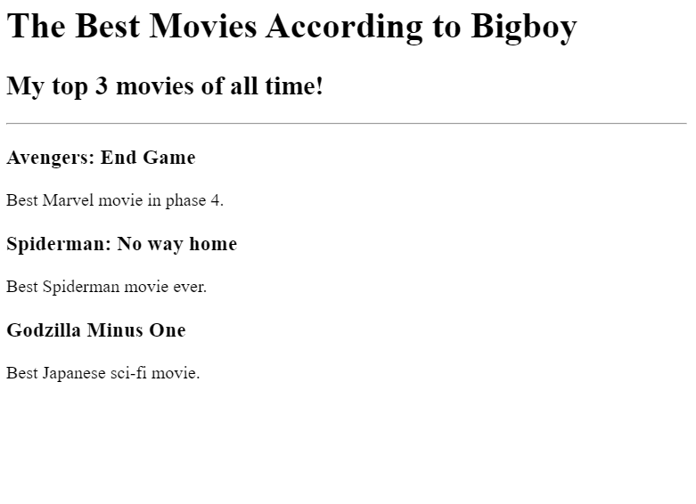
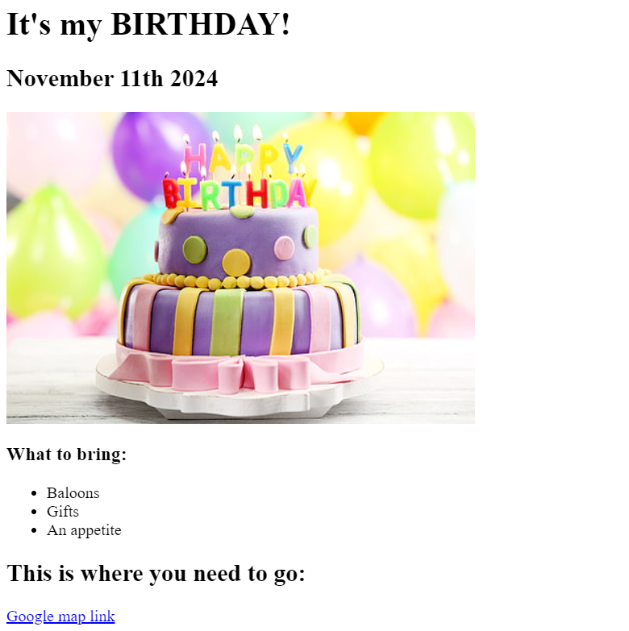

# Minh Nguyen's first Portfolio

Welcome to my portfolio (V1)! This project is a simple HTML-based website that showcases a few of my web development projects. Below is an overview of the structure and features included in this portfolio.

## Table of Contents

- [Introduction](#introduction)
- [Project Features](#project-features)
- [Screenshots](#screenshots)
- [Usage](#usage)
- [Contact](#contact)

## Introduction

This is my first web development portfolio project. It serves as a personal website where I can display some of the projects I've worked on, along with links to my "About Me" and "Contact Me" pages.

## Project Features

- **Homepage:** Introduces who I am and showcases links to two of my projects: a Movie Ranking project and a Birthday Invitation project.
- **Movie Ranking Project:** This page presents my movie ranking application.
- **Birthday Invite Project:** This page demonstrates a web application for sending birthday invitations.
- **About and Contact Pages:** Additional sections where users can learn more about me and get in touch.

## Screenshots

- **Movie Ranking Project:**
  

- **Birthday Invite Project:**
  

## Usage

To view this project locally:
1. Clone the repository to your local machine using `git clone <repository-url>`.
2. Navigate to the `index.html` file in your browser to explore the portfolio.

Alternatively, you can visit the live website (if deployed).

## Contact

Feel free to contact me through the contact page in this portfolio or reach out to me directly at:
- **Email:** [quangminh111104@gmail.com](mailto:quangminh111104@gmail.com)
- **LinkedIn:** [Minh Nguyen Profile](https://www.linkedin.com/in/minhnguyen1111/)

Thank you for checking out my portfolio!
